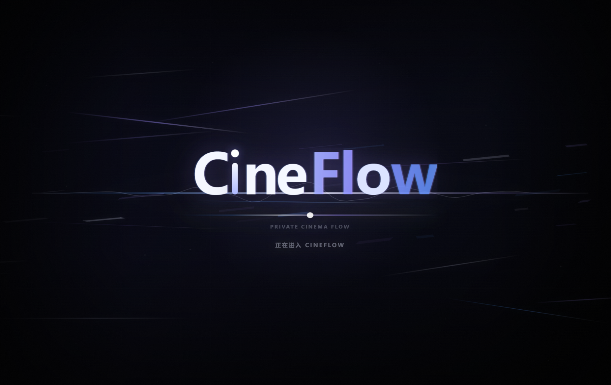

# CineFlow



流畅、可定制的桌面电影 / 节目推荐应用。

**CineFlow** 基于 Electron + Vite 构建，使用 TMDB 数据源，支持自然语言搜索、个性化推荐、灵动岛模式与应用内播放。

## 简介

**CineFlow** 是一款面向 Windows 桌面的电影 / 节目推荐应用，主打简洁高级的黑曜石 UI、圆角窗口、灵动岛模式与应用内播放体验。它使用 TMDB 作为元数据源，支持电影、电视剧、节目、演员、关键词与类型发现。

## 功能亮点

- **每日推荐**：首页展示今日电影 / 节目、海报、评分、类型与简介。
- **电影 + 节目双检索**：同时覆盖 TMDB `movie` 与 `tv`，电视剧 / 综艺 / 节目都能被搜索与推荐。
- **自然语言搜索**：支持电影名、节目名、演员、题材、关键词，并自动扩展相关推荐。
- **风格探索**：动作、科幻、爱情、悬疑、动画、恐怖、喜剧、剧情等类型快速发现。
- **个性化推荐**：基于本机点击、收藏与搜索偏好调整推荐内容。
- **介绍页**：海报、简介、评分、上映 / 首播信息、季数、集数、主演、主创、相似推荐一屏展示。
- **灵动岛模式**：最小化后切换为灵动岛，支持拖动、展开搜索、贴边吸附与一键恢复主窗口。
- **应用内播放**：支持 HLS / DASH / FLV，电视剧资源可在播放器内显示本季剧集并切集。
- **播放优化**：窗口态拖动进度条抑制加载圈，全屏播放优先尝试 4K 并保持自适应回退。
- **本机安全配置**：TMDB Key、代理与偏好设置保存在本机，不写入源码或安装包。

## 下载与安装

前往 GitHub Releases 下载最新版本：

[下载 CineFlow 最新版](https://github.com/incldue/CineFlow/releases)

当前正式版：

```text
CineFlow-1.0.0-Setup.exe
CineFlow-1.0.0-win-x64-portable.zip
```

支持环境：

- Windows 10 / Windows 11
- x64 架构

## 快速开始

### 1. 配置 TMDB

CineFlow 使用 TMDB 获取电影 / 节目元数据。首次启动后：

1. 点击右上角设置按钮。
2. 填入 TMDB v3 API Key 或 Read Access Token。
3. 点击保存并测试连接。

开发模式也可以复制 `.env.example` 为 `.env`：

```ini
TMDB_API_KEY=
TMDB_READ_TOKEN=
```

两者任选其一即可。**(关于申请TMDB的API可以看目录内的"申请API.md").**

### 2. 代理设置

如果本机开启代理后可以在浏览器内访问 TMDB，但 CineFlow 提示网络失败，可在设置页填写：

```text
system
http://127.0.0.1:7890
socks5://127.0.0.1:7890
direct
```

- `system`：使用系统代理。
- `direct`：强制直连。
- `http://` / `socks5://`：使用指定本地代理。

## 项目结构

```text
CineFlow/
├─ build/                # 应用图标等构建资源
├─ electron/             # Electron 主进程与 preload
├─ scripts/              
├─ src/
├─ index.html
├─ package.json
├─ vite.config.mjs
|--申请API.md
└─ README.md
```

## License

本项目基于 [MIT License](LICENSE) 开源。

