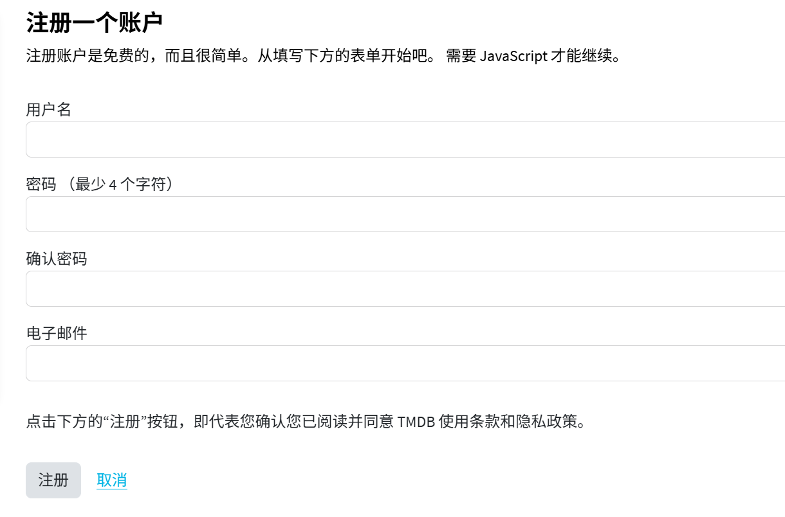
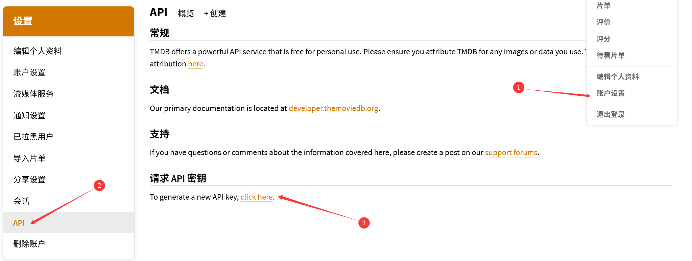
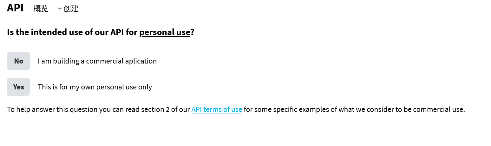
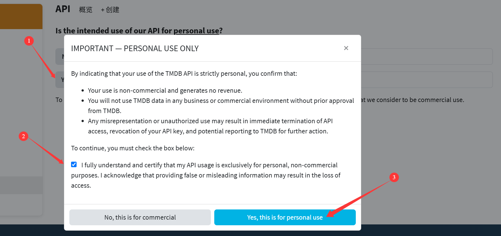
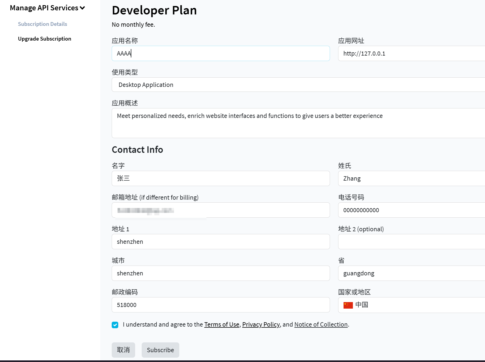
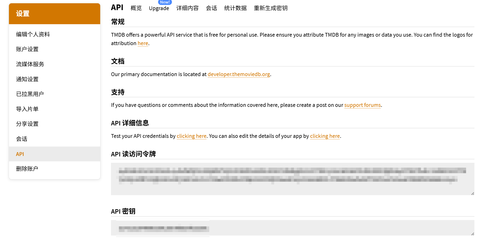

### 如何申请TMDB的API

对于**CineFlow**来说，如果没有这个API，就相当于junk。下面是详细的API申请流程

#### 一、注册/登录

首先访问 [TMDB官网](https://www.themoviedb.org/)并点击右上角的**加入TMDB**/**登录**，根据输入框依次填写信息并提交

要验证邮箱就根据提示验证邮箱，最后进行登录

进入登录完的页面后，就申请API

#### 二、进入申请页面

依次点击右上角用户名、账户设置、API、请求API密钥。

然后进入API申请页面

#### 三、申请API

点击页面`This is for my own personal use only`行所对应的**Yes**按钮，依次点击按钮

就进入了开发者计划的API申请页面，然后如下填写 (也可自行发挥)

应用概述可以写：`Meet personalized needs, enrich website interfaces and functions to give users a better experience`

申请完后在跳转的页面点击按钮`Access your API key details here.`即可查看自己的API

经过以上的操作流程，您就可以填写申请的API至**CineFlow**的设置，然后正常使用该应用了。

使用愉快！